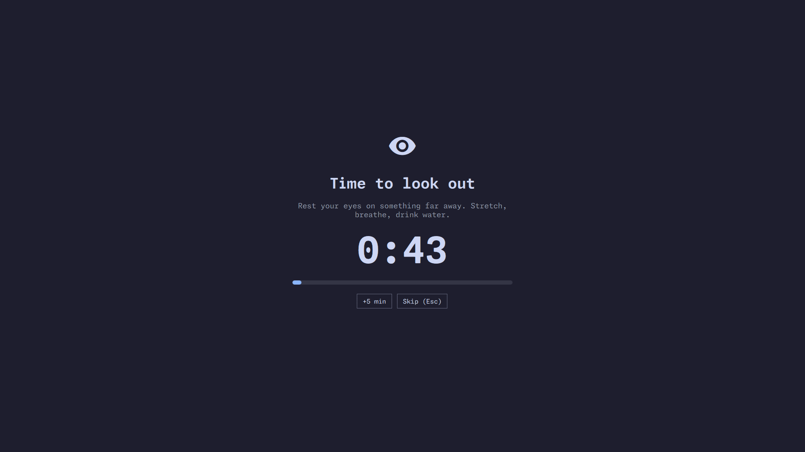

# LookOut

Break reminder plugin for the Omarchy shell. Modeled on LookAway for macOS.



LookOut counts down from your last break. When the countdown ends, a
full-screen break screen tells you to look away from the screen for a short
time. Time away counts as a break, and a break waits for a call or a video
to end.

## Install

```sh
omarchy plugin add https://github.com/dpaluy/omarchy-lookout.git --enable
```

The pill goes in the right section of the bar. Update with
`omarchy plugin update dpaluy.lookout`.

## Remove

```sh
omarchy plugin remove dpaluy.lookout
```

This disables the plugin and deletes its folder. LookOut keeps no files of
its own. Its settings are on its widget entry in
`~/.config/omarchy/shell.json`.

## Dependencies

All of these come with Omarchy:

- Omarchy shell (Quickshell) with the Mpris and idle monitor services
- `pactl` (PipeWire with `pipewire-pulse`), to find apps that record from
  the microphone
- `/proc`, to find processes that have a camera open

Without `pactl`, LookOut sees no calls. The rest works.

## Bar pill

| Pill | Icon | Meaning |
|------|------|---------|
| `44m` | eye | Time to the next break |
| `Now` | eye | The countdown ended; the break starts in a moment |
| `Wait` | eye | The countdown ended; the break waits for the video to stop |
| `Wait` | phone | The countdown ended; the break waits for the call to end |
| `Idle` | closed eye | No input; this time counts as a break |
| `Paused` | pause | You paused LookOut |

Click the pill to open the popup.

## Popup

- The phase and the time: "Break starts in", "Break after the call",
  "Break after the video", "Away: counts as a break", "LookOut is paused",
  or "Break ends in".
- "In a call: <apps>": while a break waits, the apps that LookOut sees as a
  call.
- **Start break**: starts a break now. During a break it is **Skip break**
  (only when skipping is allowed).
- **+1m**, **+5m**, **+15m**: add time to the countdown.
- **Pause LookOut** / **Resume**: stop or continue the countdown.
- **Settings**: opens the settings view. **Done** goes back.
- Current focus time, the time since the last break, and the break length.

## Break screen

The break screen covers every monitor. It takes the keyboard and the mouse,
so the apps below get no input. It shows:

1. An eye icon
2. "Time to look out"
3. "Rest your eyes on something far away. Stretch, breathe, drink water."
4. The time left in the break, and a progress bar
5. **+5 min** and **Skip (Esc)**, only when "Allow skipping a break" is on

The break ends by itself when the time is over. Then the countdown starts
again from the full interval.

## Rules

### Countdown

- The countdown starts from the interval (45 min by default) when the shell
  starts, and after each break.
- It always runs while you are at the computer, also during calls and
  videos. Both are screen time.
- When it reaches 0, the break starts, or waits while you are busy (see
  below).
- Restarting the shell starts a new countdown. LookOut does not keep its
  state on disk.

### Away time (smart timer)

- No keyboard or mouse input for the idle time (60 s by default) changes the
  pill to `Idle`.
- When you come back, the away time counts as a break: the countdown starts
  again from the full interval, and "Last break" updates.
- Sleep and suspend count as a break too. A gap of at least the idle time
  between two timer checks means the machine slept.
- Time without input while you are busy (in a call or watching a video) is
  not a break. LookOut checks before it marks you idle.
- Idle time does not change a pause or a running break.

### Busy: calls and videos

- If the countdown reaches 0 while you are busy, the break waits. The pill
  shows `Wait`. The break starts when you are no longer busy.
- LookOut checks when the countdown reaches 0, then every 15 s while the
  break waits. A video that stops starts the break at once.
- A call is an app that records from the microphone, or a process that has a
  camera (`/dev/video*`) open. A muted call is still a call, because the app
  keeps the microphone open.
- Not a call: monitor sources (sound output capture), corked (stopped)
  streams, the PipeWire services, and the apps in "Apps that are not calls".
- A video is a playing MPRIS player of a browser or a video player: Chrome,
  Chromium, Firefox, Brave, Vivaldi, Edge, Opera, Zen, LibreWolf, mpv, VLC,
  Celluloid, Totem, Haruna, SMPlayer, Kodi, Jellyfin, Plex, Stremio,
  FreeTube.
- Music players (Spotify, for example) are not busy. Music or audio that
  plays in a browser tab is, because LookOut cannot tell it from a video.
- "Wait for calls and videos" off: LookOut does not check. The break starts
  at 0, and time without input always counts as a break.

### Pause

- Pause stops the countdown at its current time. Resume continues from
  there. If no time was left, the break comes due at once (and waits while
  you are busy, as above).
- Pause from `Idle` keeps a full interval for when you resume.
- You cannot pause during a break.
- A pause has no time limit. It stays until you resume or restart the shell.

### Postpone

- +1m, +5m, and +15m add to the time left. During a pause, they add to the
  stopped time. While a break waits, they start a new countdown of that
  length.
- +5 min on the break screen ends the break and starts a 5 min countdown.
- Postpone does nothing while you are `Idle`.

### Skip

- Skip ends the break and starts the countdown from the full interval.
- A skipped break does not count as a break: "Last break" does not change.

### Settings changes

- A new interval moves the running countdown by the difference. For example,
  45 min to 30 min with 20 min left gives 5 min left. It does not go below 0.
- The other settings apply at once.

## Settings

Open the popup and click **Settings**, or run
`omarchy bar set dpaluy.lookout <key> <value>`. The values are kept on the
widget's entry in `~/.config/omarchy/shell.json`. Without the widget in the
bar, the defaults apply.

| Key | Settings label | Default | Range | Meaning |
|-----|----------------|---------|-------|---------|
| `intervalMin` | Minutes between breaks | 45 | 1 to 240 | Time from one break to the next |
| `breakSec` | Break length (sec) | 45 | 5 to 1800 | Time the break screen stays |
| `idleSec` | Idle time that counts as a break (sec) | 60 | 10 to 3600 | Time without input that counts as a break |
| `waitWhenBusy` | Wait for calls and videos | true | | A due break waits until a call or a playing video ends |
| `allowSkip` | Allow skipping a break | true | | Show +5 min and Skip on the break screen; Esc skips |
| `ignoredApps` | Apps that are not calls | `cava,easyeffects` | | Comma-separated app or process names that record audio but are not calls |

A value out of range is changed to the nearest limit. A missing or invalid
value uses the default. In the settings view, press Enter to save
"Apps that are not calls".

## Commands

```sh
omarchy-shell lookout start        # start a break now
omarchy-shell lookout skip         # end the current break
omarchy-shell lookout postpone 5   # add minutes
omarchy-shell lookout pause        # stop the countdown
omarchy-shell lookout resume       # continue it
omarchy-shell lookout toggle       # pause or resume
omarchy-shell lookout status       # JSON state

omarchy-shell dpaluy.lookout open    # open the popup
omarchy-shell dpaluy.lookout close   # close it
omarchy-shell dpaluy.lookout toggle  # open or close it
```

`status` returns:

```json
{"phase":"working","remainingSec":2530,"focusSec":515,"inCall":false,
 "videoPlaying":false,"lastBreakAt":null,"callApps":[]}
```

`phase` is one of `working`, `idle`, `due`, `break`, `paused`. `due` means
the countdown ended and the break waits while you are busy. `inCall` and
`callApps` are set only while a break waits.

## Files

| File | Purpose |
|------|---------|
| `manifest.json` | Plugin ID, entry points, defaults, and settings schema |
| `Model.js` | State machine, call probe parser, and video player match (no Qt) |
| `Service.qml` | Timers, idle monitor, busy check (call probe and MPRIS), and IPC |
| `BarWidget.qml` | Bar pill and popup |
| `SettingsView.qml` | Settings view in the popup |
| `BreakOverlay.qml` | Break screen on every monitor |

## Develop

Link a checkout in place of the installed plugin:

```sh
ln -s ~/Projects/omarchy/lookout ~/.config/omarchy/plugins/dpaluy.lookout
omarchy-shell shell rescanPlugins
omarchy bar put dpaluy.lookout
```

Changes do not hot-reload through a link. Run `omarchy restart shell` to
load them.

```sh
tests/run                  # state machine, call probe parser, and video match (node)
tests/qml-smoke            # loads the QML in a bare Quickshell
omarchy plugin validate .
```

## License

[MIT](LICENSE). See [CHANGELOG.md](CHANGELOG.md) for the changes in each
version.

LookOut is an independent project. It is not created by, affiliated with,
or supported by LookAway.

---

Supported by [majesticlabs.dev](https://majesticlabs.dev) · Majestic Labs LLC · Austin, TX
